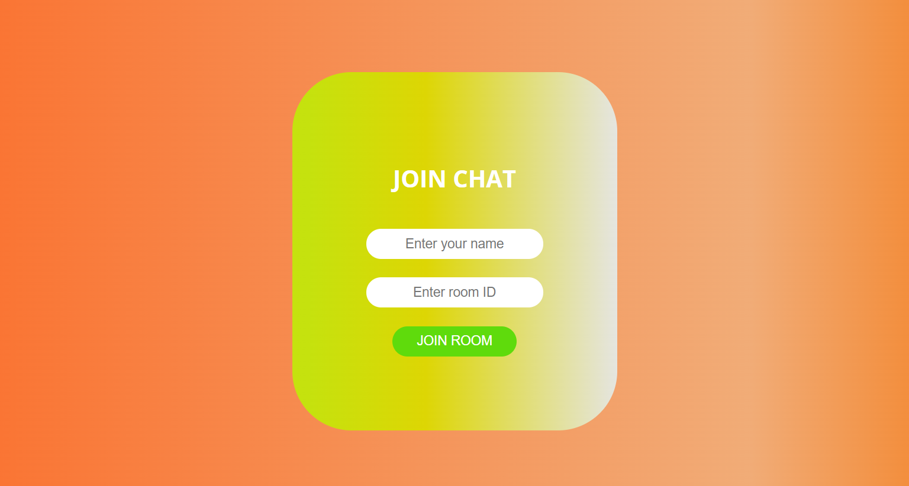
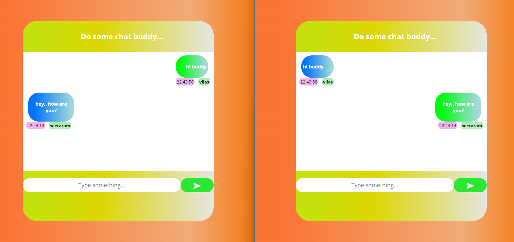

# SOCKET CHAT APP using ReactJS and NodeJS

This is a chat app that I built using Socket.io, React and NodeJS. 
Socket.IO is a library that enables low-latency, bidirectional and event-based communication between a client and a server.
It is built on top of the WebSocket protocol and provides additional guarantees like fallback to HTTP long-polling or automatic reconnection.
          

## SOME SNAPSHOTS OF THE PROJECT

1. **Home Page**

2. **Chatting Page**

